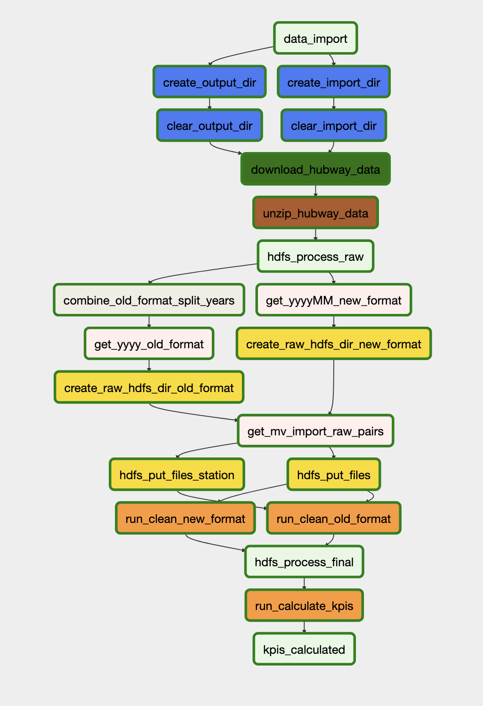

## Overview
ETL workflow to work with hubway bosten bikerental data. It is fully automatically calculating the following KPIs:

- Average Trip Duratio (in minutes)
- Average Trip Distance (in km)
- Usage Share by gender (in percent)
- Usage Share by age (in percent)
- Top 10 most used bikes
- Top 10 most start Stations
- Top 10 most end Stations
- Usage share per time slot (in percent):
    - 00:00-6:00
    - 06:00-12:00
    - 12:00-18:00
    - 18:00-24:00

## How to run?

1. Run 'docker-compose up -d'
2. Go to localhost:8080/admin
3. Start Bikesharing dag
4. Copy the output KPI file with: 'docker cp $CONTAINER_ID:/home/airflow/bikesharing_output $LOCAL_DESTINATION_PATH'

## ETL Workflow Explaination

the pipeline consists of three main phases:

### 1. **Extract Phase**
- Downloads raw bikesharing Data from Kaggle API
- Extracts compressed files to local filesystem

### 2. **Transform Phase**
- Uploads raw data to HDFS distributed storage
- Processes two different data formats (old and new) seperately using Spark
- Joins old_format trip data with Station location information
- Validates and cleanses data based on business rules
- Stores cleaned data in partitioned Parquet format

### 3. **Transform 2 + Load Phase**
- Reads cleaned "final" data from HDFS
- Calculates monthly KPIs per month and year
- Outputs results to Excel file with one spreedsheet per year

### Personal Challengaes 
- There are 2 types of csv containing ride data -> Unify into a shared df format.
- For the older data format, there is no birth date so KPIs relating to age are left out.
- In the old format there is no station information directly included in each row so we first have to join with a station csv.
- The old format has data only on a yearly basis so we partition by /yyyy/MM for final data in HDFS

## Airflow DAG: `BikeSharing`

**File:** airflow_vol/dag_flow.py

### DAG Tasks and Descriptions

#### **Data Preparation Tasks**

| Task ID | Purpose | Business Rules |
|---------|---------|----------------|
| `create_import_dir` (CreateDirectoryOperator) | Creates `/home/airflow/bikesharing_input` directory | Ensures local staging area exists for downloads |
| `clear_import_dir` (ClearDirectoryOperator) | Removes all files from import Directory | Prevents stale data from previous runs |
| `create_output_dir` (CreateDirectoryOperator) | Creates `/home/airflow/bikesharing_output` directory | Ensures output directory exists for KPI results |
| `clear_output_dir` (ClearDirectoryOperator) | Removes all files from output directory | Ensures fresh KPI calculations |

#### **Data Download Tasks**

| Task ID | Purpose | Business Rules |
|---------|---------|----------------|
| `download_hubway_data` (HttpDownloadOperator) | Downloads Hubway dataset ZIP from Kaggle API | Retrieves complete historical Dataset |
| `unzip_hubway_data` (UnzipFolderOperator) | Extracts ZIP contents to local filesystem | Unpacks raw CSV files for processing |
| `combine_old_format_split_years` (BashOperator) | Concatenates split year files (e.g., `hubway_Trips_2014_1.csv`, `hubway_Trips_2014_2.csv` → `hubway_Trips_2014.csv`) | Old format data was split into multiple files per year; combines them for unified processing |

#### **Metadata Extraction Tasks**

| Task ID | Purpose | Business Rules |
|---------|---------|----------------|
| `get_yyyy_old_format` (PythonOperator) | Extracts year values from old-format filenames (`hubway_Trips_YYYY.csv`) using `get_yyyy_old_format()` | Returns sorted list of years (e.g., `['2011', '2012', '2013', '2014']`) |
| `get_yyyyMM_new_format` (PythonOperator) | Extract yyyyMM values from new-format filenames (`YYYYMM-hubway-tripdata.csv`) using `get_yyyyMM_new_format()` | Returns sorted list of year-months (e.g., `['201601', '201602', ...]`) |
| `get_mv_import_raw_pairs` (PythonOperator) | Generates (source, destination) path pairs for HDFS upload using `get_mv_import_raw_pairs()` | Maps local files to HDFS partition directories |

#### **HDFS Setup Tasks**

| Task ID | Purpose | Business Rules |
|---------|---------|----------------|
| `create_raw_hdfs_dir_old_format` (HdfsMkdirsFileOperator) | Creates HDFS directories `/data/bikesharing/raw/YYYY/` for each old-format year | Prepares HDFS partition Structure for yearly data |
| `create_raw_hdfs_dir_new_format` (HdfsMkdirsFileOperator) | Creates HDFS directories `/data/bikesharing/raw/YYYYMM/` for each new-format month | Prepares HDFS partition Structure for monthly data |
| `hdfs_put_files` (HdfsPutFilesOperator) | Uploads trip CSV files to HDFS using path pairs from `get_mv_import_raw_pairs` | Moves raw data into distributed Storage |
| `hdfs_put_files_station` (HdfsPutFilesOperator) | Uploads station master file `Hubway_Stations_2011_2016.csv` to HDFS `/data/bikesharing/raw/` | Provides station coordinates for distance calculations |

#### **Spark Processing Tasks**

| Task ID | Purpose | Business Rules |
|---------|---------|----------------|
| `run_clean_new_format` (SparkSubmitOperator) | Executes cleanNewFormat.py Spark job | Processes new-format data (2016+) with native Station coordinates |
| `run_clean_old_format` (SparkSubmitOperator) | Executes cleanOldFormat.py Spark job | Processes old-format data (2011-2015) by joining with station master file |
| `run_calculate_kpis` (SparkSubmitOperator) | Executes calculateKPIs.py Spark job | Generates monthly KPI Excel report from cleaned Data |

#### **Dummy Tasks (Orchestration)**

| Task ID | Purpose |
|---------|---------|
| `data_import` | Synchronization point after data preparation completes |
| `hdfs_process_raw` | Synchronization point before HDFS operations begin |
| `hdfs_process_final` | Synchronization point after Spark cleaning completes |
| `kpis_calculated` | Final synchronization point after KPI generation |

## Spark Jobs

### 1. Clean New Format Data

**File:** cleanNewFormat.py

**Purpose:** Processes bikesharing trip data from 2016 onwards (new format with embedded station coordinates).

**Input:** HDFS `/data/bikesharing/raw/YYYYMM/data.csv` folders

**Output:** HDFS `/data/bikesharing/final/` (Parquet, partitioned by year/month)

**Business Rules:**
- **Trip Duration:** Calculated from `tripduration` seconds, rounded to 2 decimal places in minutes
- **Timestamps:** Parses `starttime` and `stoptime` to timestamps
- **Distance:** Calculates Haversine distance using embedded station lat/lon coordinates
- **Time Slots:** Assigns trips to 6-hour buckets (00:00-06:00, 06:00-12:00, 12:00-18:00, 18:00-24:00)
- **Birth Year:** Normalizes null values (`\N`, `0`) and validates range (1900-2020)
- **Gender:** Casts to integer, handles null/`\N` values
- **Data Validation:** Filters out records with:
  - Invalid timestamps (null or end before start)
  - Trip duration outside 1-1440 minutes (1 day max)
  - Distance outside 0-50,000 meters (50km max)
  - Missing station IDs

### 2. Clean Old Format Data

**File:** cleanOldFormat.py

**Purpose:** Processes bikesharing trip data from 2011-2015 (old format requiring station lookup).

**Input:** 
- HDFS `/data/bikesharing/raw/YYYY/data.csv` folders
- HDFS `/data/bikesharing/raw/Hubway_Stations_2011_2016.csv` station masterfile

**Output:** HDFS `/data/bikesharing/final/` (Parquet, partitioned by year/month)

**Business Rules:**
- **Station Join:** Left-joins trip data with station master using `Start station number` and `End station number` to obtain coordinates
- **Trip Duration:** Calculated from `Duration` seconds
- **Timestamps:** Parses `Start date` and `End date`s
- **Distance:** Calculates Haversine distance using joined station coordinates
- **Time Slots:** Same 6-hour bucket assignment as new format
- **Birth Year:** Sets to null (old format lacks birth year Data)
- **Gender:** Same normalization as new format
- **Data Validation:** Same filtering criteria as new format
- **Station Validation:** Validates station master data:
  - Coordinates in valid ranges (lat: -90 to 90, lon: -180 to 180)
  - Station ID successfully casts to integer
  - Logs duplicate station IDs and validation failures

### 3. Calculate KPIs

**File:** calculateKPIs.py

**Purpose:** Generates monthly KPI summary statistics from cleaned trip data.

**Input:** HDFS `/data/bikesharing/final/` (Parquet)

**Output:** Local `/home/airflow/bikesharing_output/kpis.xlsx` (Excel with year-based sheets)

**Calculated KPIs:**

| KPI Category | Metrics | Business Rules |
|--------------|---------|----------------|
| **Trip Statistics** | Average trip duration (minutes), Average trip distance (km) | Aggregated monthly, rounded to 2 decimals |
| **Demographics** | Gender distribution (%) by gender code | Percentage of total trips with non-null gender |
| **Age Analysis** | Age group distribution (%) | Groups: 10-19, 20-29, 30-39, 40-49, 50-59, 60-69, 70+ Calculated from birth year (excludes ages <10 or >100) |
| **Asset Utilization** | Top 10 bikes by trip count | Bike ID with trip count |
| **Station Popularity** | Top 10 start stations by trip count Top 10 end stations by trip count | Station name with trip count |
| **Temporal Patterns** | Trip distribution by time slot (%) | Percentage across 4 daily time slots |

**Output Format:**
- One Excel sheet per year
- Each row represents one month
- Columns dynamically include all calculated KPIs

## Plugin Files

### Operators

| Operator | Purpose | Key Parameters | Notes |
|----------|---------|----------------|-------|
| CreateDirectoryOperator | Creates directory if it doesn't exist | `path`: Directory path to create | Already existing from base course airflow image. |
| ClearDirectoryOperator | Deletes files matching glob pattern in directory | `directory`: Target directory `pattern`: File matching pattern (default: `*`) | Extended from base course airflow image to support removing subfolders too. |
| HdfsMkdirsFileOperator | Creates parent directory and multiple subdirectorys in HDFS | `hdfs_parent_dir`: Parent directory path `dir_names`: List of subdirectory names | Extended from base course airflow container to support creating an array of folders. |
| HdfsPutFilesOperator | Uploads multiple files to HDFS using (local, remote) path tuples | `file_pairs`: List of (local_path, hdfs_path) tuples | Extended from base course airflow cotnainer to support multiple files. |
| HttpDownloadOperator | Downloads file from HTTP URI with error handling | `download_uri`: Source URL `save_to`: Local destination path | Already existing from base course airflow image. |
| UnzipFolderOperator | Extracts ZIP archive to target directory | `zip_file`: Path to ZIP archive `extract_to`: Extraction destination directory | Based on unzip file existing operator to support folders instead. |

## Utility Functions

**File:** file_name_formatting.py

| Function | Purpose | Returns |
|----------|---------|---------|
| `get_yyyyMM_new_format()` | Extracts YYYYMM from new-format filenames using regex `(\d{6})-hubway-tripdata\.csv$` | Sorted list of strings (e.g., `['201601', '201602']`) |
| `get_yyyy_old_format()` | Extracts YYYY from old-format filenames using regex `hubway_Trips_(\d{4})\.csv$` | Sorted list of strings (e.g., `['2011', '2012']`) |
| `get_yyyyMM_old_format()` | Expands yearly old-format data to monthly partitions | Sorted list of YYYYMM strings for all months in each year |
| `get_mv_import_raw_pairs()` | Generates (local_path, hdfs_path) tuples for both formats | List of tuples mapping local CSV files to HDFS partition directorys |

## Infrastructure

**File:** docker-compose.yml

### Services

| Service | Image | Ports | Purpose |
|---------|-------|-------|---------|
| `hadoop` | `marcelmittelstaedt/spark_base:latest` | 8088 (YARN), 9870 (HDFS NameNode), 9000 (HDFS), 8888 (Jupyter) | Hadoop HDFS + YARN + Spark cluster |
| `airflow` | `marcelmittelstaedt/airflow:latest` | 8080 (Webserver) | Airflow scheduler and webserver with modified operators |

**Volumes:**
- dags → DAG definitions
- plugins → Modified operators
- spark → Spark job Python scripts
- startup.sh → Hadoop initialization script (before it didnt start the hadoop process on container start)
